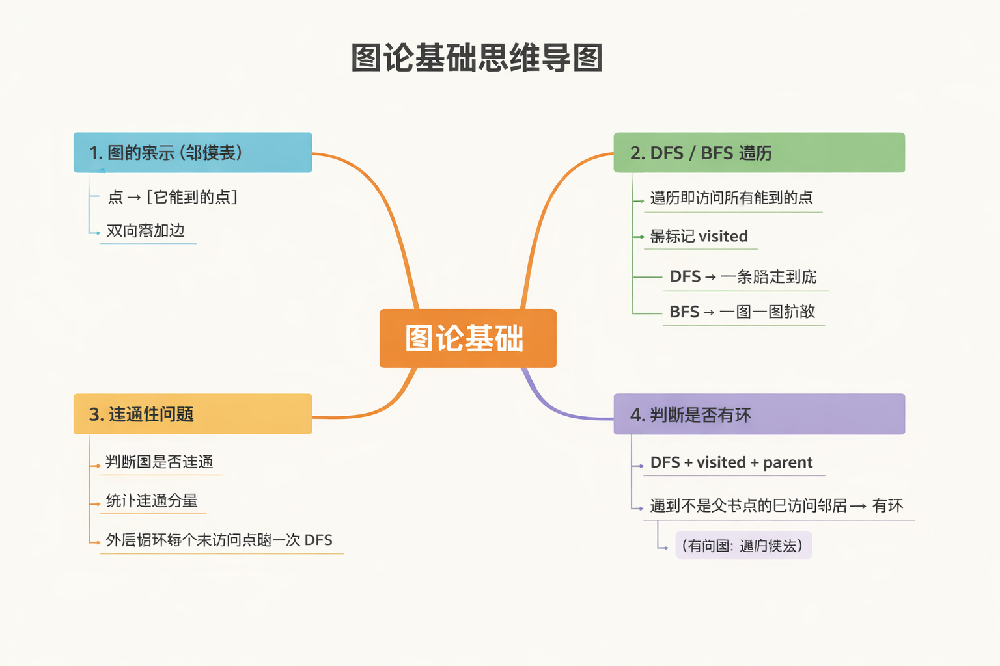

# 第一阶段 · 第 1 课
  **图的表示(邻接表)**

  在正式写代码、谈 DFS / BFS 之前, **最重要的一步只有一个:**
  > 👉 要先能“把图存起来”

  ---
  
## 什么是「图」?
   最朴素的理解:
   - **点(Vertex/Node)**: 一个对象
   - **边(Edge)**: 点与点之间的关系
  
   举例:
   ```
    A —— B
    |    |
    C —— D
   ```
   - 点: A, B, C, D
   - 边:
     - A - B
     - A - C
     - B - D
     - C - D
     
   ⚠️ 现在只考虑 **无向图**, 方向先不谈

   ---

## 计算机里怎么表示图？
   有两种最常见方式:
   1. **邻接矩阵**（不推荐新手一开始学）
   2. **邻接表**（我们要学的）

   👉 **我们先只学邻接表**

   ---

## 邻接表到底是什么?(核心思想)
   一句话定义: 
   > **对每一个点，记录“它能直接走到哪些点”**

   ---

   **例子: 把刚才的图编号**
   ```
   为了方便计算机，我们不用 A B C D，用数字:
   
   0 —— 1
   |    |
   2 —— 3
   ```
   边是:
   - 0 - 1
   - 0 - 2
   - 1 - 3
   - 2 - 3

   ---

   **邻接表怎么写?**

   **逐个点来看:**
   - 点 0: 能到 1、2
   - 点 1: 能到 0、3
   - 点 2: 能到 0、3
   - 点 3: 能到 1、2

   👉 邻接表就是:
   ```
   0: [1, 2]
   1: [0, 3]
   2: [0, 3]
   3: [1, 2]
   ```
   这就是 **邻接表的全部本质**

## 把邻接表理解成「花名册」
   这样理解:
   - 每一行 = 一个点
   - 这一行的列表 = 这个点的邻居
   ```
   点 0 的朋友名单 → [1, 2]
   点 1 的朋友名单 → [0, 3]
   ```

   📌 **只关心“直接相连”的点**

## 为什么不用邻接矩阵?(只说直觉)
   邻接矩阵是一个 `n × n` 的表:
   - 点很多, 但边很少 **→ 浪费空间**
   - 邻接表:
     - 只记录真实存在的边
     - **更省空间**
     - **DFS / BFS 更方便**
   👉 **90% 的算法题, 默认用邻接表**
     
   ---

## 用代码怎么存?(先不写 DFS)
   **伪代码(不用管语言)**
   ```
   graph = [
      [1, 2],  // 0
      [0, 3],  // 1
      [0, 3],  // 2
      [1, 2]   // 3
   ]
   ```
   含义:
   - graph[0] → 点 0 的所有邻居
   - graph[0][0] → 点 0 的第一个邻居

   ---
   
   **Rust:**
   ```rust
   let graph: Vec<Vec<usize>> = vec![
        vec![1, 2],
        vec![0, 3],
        vec![0, 3],
        vec![1, 2],
   ];
   ```
   含义:
   - **外层 Vec: 所有点**
   - **内层 Vec: 某个点的邻居**

   ---

## 非常重要的一个点
   **无向图: 边要加两次 ❗**
   ```
   如果有一条边:
   u —— v
   ```
   必须:
   - 在 u 的邻接表里加 v
   - 在 v 的邻接表里加 u
 
   否则:
   👉 图就“断了一半”

   ---

# 第一阶段 · 第 2 课
  **DFS / BFS 遍历**

  先把“走图”这件事，在脑子里走通

  ---

## 什么叫「遍历」?
   一句话:
   > **从一个起点出发，把“能到的点”一个不漏地访问一遍**
 
   比如这张图:
   ```
   0 —— 1 —— 3
   |
   2
   ```
   从 `0` 出发，你最终应该访问到:
   ```
   0, 1, 2, 3
   ```
   顺序可能不同，但每个点都要被访问一次

   ---

## 为什么一定要有 visited?
   这是**图遍历里第一条铁律:**
   > ❗图里可能有环
   >
   > ❗不记录访问状态 = 死循环

   **举个最小反例:**
   ```
   0 —— 1
   ```
   如果:
   - 从 0 走到 1
   - 从 1 走到 0
   - 再从 0 走到 1……

   👉 无限循环
   
   所以必须有:
   ```
   visited[u] = 是否访问过
   ```

   ---

## DFS 和 BFS 的本质区别
1. DFS(深度优先)
   核心思想:
   > **一条路走到黑，走不动了再回头**

   就像迷宫:
   - 能往前就一直往前
   - 碰壁了再退回来
   
   ---

2. BFS(广度优先)
   核心思想:
   > **一圈一圈地扩散**

   就像水波:
   - 先访问离起点最近的点
   - 再访问更远的
   
   ---

## 用同一张图对比 DFS / BFS   
   用这张图(邻接表):
   ```
   0: [1, 2]
   1: [0, 3]
   2: [0]
   3: [1]
   ```

   图形:
   ```
         3
         |
    0 —— 1
    |
    2
   ```
   起点: `0`

   ---

## DFS 是怎么“走”的?
   **规则**:
   - 访问当前点
   - 标记为 visited
   - 对每个邻居
     - 如果没访问过 → 继续 DFS 

   ---

   **过程:**
   - 到 `0` → 访问 `0`
   - 从 `0` 走到 `1`
   - 访问 `1`
   - 从 `1` 走到 `3`
   - 访问 `3`
   - `3` 没新路 → 回到 `1`
   - `1` 没新路 → 回到 `0`
   - 从 `0` 走到 `2`
   - 访问 `2`

   **访问顺序(可能之一):**
   ```
   0 → 1 → 3 → 2
   ```

   📌 顺序可能不同，但原则不变。

   ---

## BFS 是怎么“走”的?
   **规则:**
   - 先访问起点
   - 把它的邻居“排队”
   - 按队列顺序一个个访问

   ---

   **过程:**
   - 访问 `0`
   - 把 `1, 2` 放进队列
   - 访问 `1`
   - 把 `3` 放进队列
   - 访问 `2`
   - 访问 `3`

   **访问顺序:**
   ```
   0 → 1 → 2 → 3
   ``` 

   ---

## 要牢牢记住的 3 件事
✅ 1. DFS / BFS 都是“遍历” 
   - 目的: **访问所有能到的点**
   - 不保证顺序唯一

   ---

✅ 2. `visited` 是必须的
   > 没有 visited = 一定死循环(只要有环)

   ---

✅ 3. 区别只在“怎么选下一个点”

   | 算法  | 核心策略   |
   | --- | ------ |
   | DFS | 一条路走到底 |
   | BFS | 一层一层扩散 |

   ---

# 第一阶段 · 第 3 课
  **连通性问题(图论里最核心的能力之一)**

## 什么叫「图是连通的」?
   只讨论 **无向图**。
    
   **定义(直觉版):**
   > **从任意一个点出发，能走到所有其他点**

   **换句话说:**
   - 选一个起点
   - 跑一次 DFS / BFS
   - **所有点都被访问到**

   👉 图是连通的, 👉 否则，不连通

   ---

## 用遍历判断连通性
   **给一张图(邻接表):**
   ```
   0: [1]
   1: [0, 2]
   2: [1]
   3: []
   ```

   图形:
   ```
   0 —— 1 —— 2   3
   ```

   **判断步骤:**
   - 从 `0` 开始 DFS/BFS
   - `visited` 变成:
   ```
   0, 1, 2 被访问
   ```
   - 点 3 没访问到

   📌 结论:
   > 图 **不连通**

   ---

## 连通分量
   **定义:**
   > **图中一组两两“互相可达”的点，构成一个连通分量**
   > 
   > **一个连通分量 = 一次 DFS / BFS 能访问到的所有点**(**🔥一次 DFS / BFS 可以完整找出一个连通分量**)

   ---
  
   **举个图**
   ```
   0 —— 1  3 —— 4
   |
   2
   ```
   - 从 `0` 出发: 只能访问 `{0, 1, 2}`
   - 从 `3` 出发: 只能访问 `{3, 4}`

   所以这个图有:
   - 2 个连通分量:
     - 连通分量 1: `{0, 1, 2}`
     - 连通分量 2: `{3, 4}` 

## 如何「统计」连通分量?
   **核心思想**
   - 准备一个`visited` 数组
   - 从 `0` 到 `n - 1`, **一个点一个点看**
   - 如果某个点 **还没被访问**
     - 说明它属于一个 **新的连通分量**
     - 从它开始跑一次 DFS/BFS
   - 每跑一次, 连通分量数里 `+ 1`

   **这是一个非常重要的“为什么”**
   > 为什么要“从未访问点再跑一次”？

   因为:
   - 上一次 DFS 只能覆盖 **一个连通分量**
   - 剩下的点, **一定在别的分量里**

## 完整走一遍例子
   图:
   ```
   0 —— 1      3 —— 4
   |
   2
   ```

   **初始化**
   ```
   visited = [false, false, false, false, false]
   count = 0
   ```

   **i = 0**
   - visited[0] = false
   - → 新连通分量
   - 从 0 DFS:
     - 访问 0, 1, 2
   - count = 1
   ```
   visited = [true, true, true, false, false]
   ```

   --- 

   **i = 1, 2**
   - 已访问 → 跳过
   
   ---

   **i = 3**
   - visited[3] = false
   - → 新连通分量
   - 从 3 DFS:
     - 访问 3, 4
   - count = 2
   ```
   visited = [true, true, true, true, true]
   ```

   ---

   **i = 4**
   - 已访问 → 跳过
 
   ---

   **最终结论:**
   > **图有 2 个连通分量**
  
## 掌握「必杀套路」
   口诀:
   > **图的连通性问题 = DFS / BFS + visited + 外层循环**


# 第一阶段 · 第 4 课
  **判断图里有没有环(Cycle Detection)**

## 什么是“环”
1. 定义(直觉)  
   > **从某个点出发, 沿着边能回到自己**, 且经过至少一条边
   ```markdown
   0 —— 1 —— 2
   |         |
   +---------+
   - 0 → 1 → 2 → 0
   - 这是一个环
   ```
   
---

2. 无向图判断环的思路
   
**核心难点**
  - 无向图里，每条边本身是双向的 
  - DFS 时会回到父节点 → 不能误判为环

---

**解决方法(直觉版)**
  - DFS 时记录 **当前点的父节点**
  - 遍历邻居:
    - 如果邻居没访问过 → 继续 DFS
    - 如果邻居已经访问过 **且不是父节点** → 找到环
  
---

**为什么？**
  - 回到父节点 → 正常回溯，不算环
  - 回到其他已经访问的点 → 形成环

---

3. 示例
```markdown
图:
0 —— 1 —— 2
|         |
+---------+

邻接表:
0: [1, 2]
1: [0, 2]
2: [1, 0]

从 0 DFS:
1. 访问 0, parent = -1
   - 走 0 → 1

2. 访问 1, parent = 0
   - 遍历邻居:
     - 0 → 父节点 → 忽略
     - 2 → 未访问 → DFS(2, parent = 1)

3. 访问 2, parent = 1
  - 遍历邻居
    - 1 → 父节点 → 忽略
    - 0 → 已访问且不是父节点 → 找到环 ✅
```

---

4. 有向图判断有没有环
   - 思路不同: 不能用 parent
   - 用 **递归栈/访问状态**:
     - 0 → 未访问
     - 1 → 访问中(在递归栈里)
     - 2 → 已访问
   - 如果访问中又被访问 → 找到环

---

5. 总结口诀(无向图版)
   > **DFS + visited + parent → 有邻居访问过且不是父节点 = 环**
   
--- 

，，，
